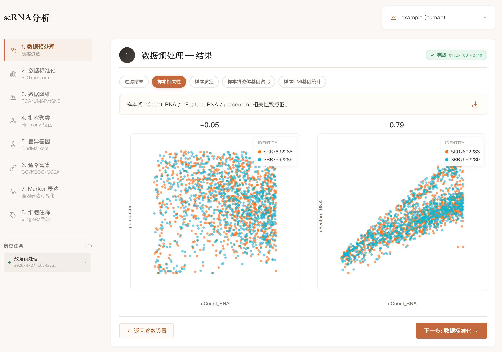
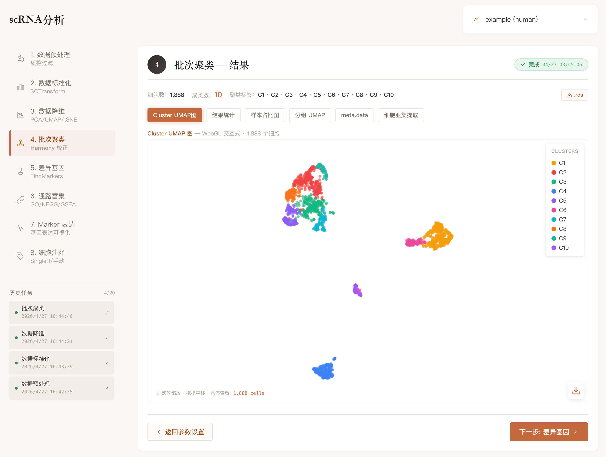
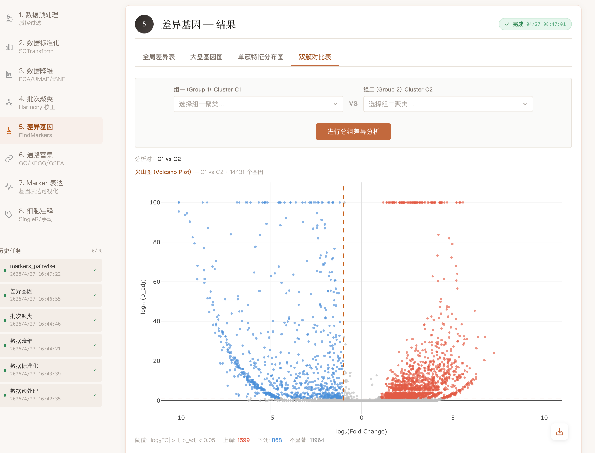

# scCloud v2 — 单细胞 RNA-seq 分析平台

> 从 R Shiny 迁移到现代全栈架构：**Next.js 16 + FastAPI + R Plumber**，支持完整的 scRNA-seq 8 步分析流程。

<p align="left">
  
  
  
  
  
  
  
  
</p>


## 文档导览

| 章节 | 内容 |
|---|---|
| [架构总览](#架构总览) | ASCII 架构图 + 技术栈表 |
| [快速开始](#快速开始--docker-compose-一键部署) | 4 步一键部署（clone → 配置 → R 镜像 → compose up） |
| [R 引擎构建](#step-3-构建-r-计算引擎镜像) | 3 种方式：预编译库（10min）/ 预构建镜像（1min）/ 从零编译（2h） |
| [分析流程](#分析流程) | 8步标准 scRNA-seq 分析及 WebGL 可视化 |
| [服务器部署](#服务器部署host-网络模式) | Host 网络模式 + 端口规划表 + 热更新命令 |
| [环境变量](#环境变量参考) | 完整参考表，标注必填项 |
| [API 端点](#api-端点) | 全部 REST + WebSocket 端点 |
| [常见问题](#常见问题) | R 引擎故障 / 数据库初始化 / 大文件超时 / OOM |
| [开发模式](#开发模式) | 前后端热重载本地开发 |


## 架构总览

```
┌─────────────────────────────────────────────────────────────┐
│                     Nginx (:9000)                           │
│            反向代理 — 统一入口                               │
├──────────────────┬──────────────────┬───────────────────────┤
│  Frontend (:3001)│  Backend (:8000) │   WebSocket (/ws/)    │
│  Next.js 16      │  FastAPI         │   任务进度推送         │
│  SSR + SPA       │  REST API        │   Redis Pub/Sub       │
├──────────────────┴──────────────────┴───────────────────────┤
│                  R-Engine (:8787)                            │
│            Plumber API — Seurat 5 计算引擎                   │
├──────────────────┬──────────────────────────────────────────┤
│ MariaDB (:3307)  │              Redis (:6380)               │
│ 用户/项目/任务    │         消息队列 + 进度缓存               │
└──────────────────┴──────────────────────────────────────────┘
```

| 组件 | 技术 | 说明 |
|------|------|------|
| 前端 | Next.js 16, deck.gl, Plotly.js | 响应式 SPA，WebGL 海量点散点图 |
| 后端 | FastAPI, SQLAlchemy 2.0, Redis | REST API + WebSocket 实时进度 |
| 计算引擎 | R 4.3.2, Seurat 5, Plumber | 无状态 HTTP 计算引擎 |
| 数据库 | MariaDB 11 | 用户认证、项目管理、任务记录 |
| 缓存 | Redis 7 | 进度推送、任务状态同步 |
| 代理 | Nginx | 反向代理、WebSocket 升级、大文件上传 |

---

## 快速开始 — Docker Compose 一键部署

### 前提条件

- **Docker** ≥ 24.0 + **Docker Compose** v2
- **内存** ≥ 16 GB（R 引擎分析大数据集时内存消耗较高）
- **磁盘** ≥ 50 GB（R 包镜像 ~2GB + 用户项目数据）

### Step 1: 克隆项目

```bash
git clone <repo_url> sccloud-v2
cd sccloud-v2
```

### Step 2: 配置环境变量

```bash
cp .env.example .env
```

编辑 `.env`，**必须修改**以下字段：

```bash
# 数据库密码 — 生产环境务必修改
DB_PASS=your_strong_password
DB_ROOT_PASS=your_root_password

# JWT 密钥 — 用以下命令生成
# openssl rand -hex 32
JWT_SECRET=your_generated_secret
```

### Step 3: 构建 R 计算引擎镜像

R 引擎是最耗时的构建步骤（包含 572 个 R 包），有两种方式：

#### 方式 A: 从预编译 R 库构建（推荐，~10 分钟）

如果你的服务器上已有完整的 R 4.3 环境（含 Seurat、Bioconductor 等）：

```bash
# 1. 复制已编译的 R 库到项目目录
cp -r /path/to/your/R/library r-engine/r-library

# 2. 构建 Docker 镜像
cd r-engine
docker build -t sccloud-r-engine .
```

#### 方式 B: 使用预构建镜像（最快）

如果项目附带了导出的镜像文件 `data/sccloud-r-engine-image.tar.gz`：

```bash
# 直接导入镜像（~2GB，约 1 分钟）
docker load < data/sccloud-r-engine-image.tar.gz
```

#### 方式 C: 从零编译安装（~2 小时）

```bash
cd r-engine
# 修改 Dockerfile，将 COPY r-library/ 替换为运行 install_packages.R
# 然后构建
docker build -t sccloud-r-engine .
```

### Step 4: 启动所有服务

```bash
# 标准模式（bridge 网络，端口映射）
docker compose up -d

# 查看日志
docker compose logs -f

# 检查健康状态
curl http://localhost:8000/api/health
```

访问 **http://localhost:3000** 即可使用。

---

## 服务器部署（Host 网络模式）

适用于需要高性能网络或服务器已占用默认端口的场景（如 GPU 服务器）。

### 端口规划

| 服务 | 端口 | 说明 |
|------|------|------|
| Nginx | 9000 | **统一入口** — 用户访问此端口 |
| Frontend | 3001 | Next.js SSR |
| Backend | 8000 | FastAPI API |
| R-Engine | 8787 | Plumber 计算 |
| MariaDB | 3307 | 避免与宿主机 3306 冲突 |
| Redis | 6380 | 避免与宿主机 6379 冲突 |

### 部署命令

```bash
# 创建服务器专用环境配置
cp .env.example .env.server
vim .env.server  # 修改密码和 JWT_SECRET

# 启动（使用 server 配置文件）
docker compose --env-file .env.server -f docker-compose.server.yml up -d --build

# 查看状态
docker compose -f docker-compose.server.yml ps

# 查看日志
docker compose -f docker-compose.server.yml logs -f r-engine
```

访问 **http://\<server-ip\>:9000**。

### 重启单个服务

```bash
# 仅重启 R 引擎（修改 R 代码后）
docker compose --env-file .env.server -f docker-compose.server.yml restart r-engine

# 仅重建前端（修改前端代码后）
docker compose --env-file .env.server -f docker-compose.server.yml up -d --build frontend
```

---

## 环境变量参考

| 变量 | 默认值 | 必填 | 说明 |
|------|--------|------|------|
| `DB_HOST` | `db` | | Docker 内部主机名 |
| `DB_PORT` | `3306` | | 数据库端口 |
| `DB_NAME` | `sccloud_v2` | | 数据库名 |
| `DB_USER` | `sccloud_app` | | 数据库用户 |
| `DB_PASS` | — | ✅ | **数据库密码** |
| `DB_ROOT_PASS` | — | ✅ | **数据库 root 密码** |
| `REDIS_URL` | `redis://redis:6379/0` | | Redis 连接字符串 |
| `JWT_SECRET` | — | ✅ | **JWT 签名密钥**（`openssl rand -hex 32`） |
| `JWT_ALGORITHM` | `HS256` | | JWT 算法 |
| `ACCESS_TOKEN_EXPIRE_MINUTES` | `15` | | 访问令牌有效期 |
| `REFRESH_TOKEN_EXPIRE_DAYS` | `7` | | 刷新令牌有效期 |
| `R_ENGINE_URL` | `http://r-engine:8787` | | R 引擎地址 |
| `R_ENGINE_TIMEOUT` | `3600` | | R 引擎请求超时（秒） |
| `PROJECTS_ROOT` | `/data/projects` | | 项目数据存储路径 |
| `MAX_UPLOAD_SIZE_GB` | `30` | | 单文件上传上限 |
| `ENVIRONMENT` | `development` | | `development` / `production` |

---

## 分析流程

支持 **8 步标准 scRNA-seq 分析**流程，每步结果自动衔接：

```
1. 数据预处理 (QC)        → 质控过滤（线粒体比例、基因数、UMI）
2. 数据标准化              → SCTransform
3. 数据降维                → PCA / UMAP / tSNE
4. 批次校正聚类            → Harmony 校正 + Louvain 聚类
5. 差异基因分析            → FindMarkers + DotPlot / Heatmap
6. 通路富集                → GO / KEGG / GSEA
7. Marker 基因表达         → FeaturePlot + VlnPlot 可视化
8. 细胞注释                → SingleR 自动注释 / 手动注释
```

### v2 独有增强

- **格式转换**：H5AD / H5Seurat / CSV / TSV ↔ RDS 双向转换
- **多样本 MTX 整合**：批量上传 10X ZIP → 自动合并 RDS
- **WebGL 交互式散点图**：deck.gl 渲染百万级细胞点
- **交互式火山图**：Plotly 双簇对比
- **实时进度推送**：Redis Pub/Sub → WebSocket

### 界面展示

<details open>
<summary><b>展开查看分析可视化图表</b></summary>

**1. 降维聚类 (UMAP)**


**2. 差异基因火山图**


**3. Marker 基因表达可视化**


</details>


---

## 项目结构

```
sccloud-v2/
├── frontend/                   # Next.js 16 前端
│   ├── Dockerfile              # 多阶段构建 (deps → build → standalone)
│   └── src/app/
│       ├── lib/api.ts          # 统一 API 客户端 + JWT 自动刷新
│       ├── components/         # 可复用组件
│       │   ├── ResultViewer.tsx # 8 步分析结果渲染（核心组件）
│       │   ├── charts/         # deck.gl 散点图、Plotly 火山图
│       │   └── TaskHistory.tsx  # 任务历史面板
│       ├── dashboard/          # 仪表盘（分析主页）
│       ├── convert/            # 格式转换页
│       └── settings/           # 用户设置
│
├── backend/                    # FastAPI 后端
│   ├── Dockerfile
│   ├── pyproject.toml          # Python 依赖
│   └── app/
│       ├── main.py             # 应用入口 + CORS
│       ├── auth/               # JWT 认证 (注册/登录/刷新)
│       ├── projects/           # 项目 CRUD
│       ├── tasks/              # 任务管理 + R 引擎调用
│       ├── upload/             # 分片上传 (大文件)
│       ├── convert/            # 格式转换
│       ├── ws/                 # WebSocket 进度推送
│       └── utils/              # R 引擎 HTTP 桥接
│
├── r-engine/                   # R 计算引擎
│   ├── Dockerfile              # rocker/r-ver:4.3.2 + 预编译 R 库
│   ├── plumber.R               # API 入口 (所有端点)
│   ├── install_packages.R      # 从零安装 R 包脚本 (备用)
│   ├── R/                      # 分析模块
│   │   ├── data_plot.R         # 绘图函数 (QC/降维/差异/Marker)
│   │   └── data_summary.R     # 数据汇总函数
│   └── data/                   # SingleR 参考数据等
│
├── nginx/
│   └── nginx.conf              # 反向代理配置
│
├── data/
│   ├── sccloud_v2_dump.sql     # 数据库初始化 SQL
│   └── sccloud-r-engine-image.tar.gz  # 预构建 R 引擎镜像 (~2GB)
│
├── docker-compose.yml          # 标准部署 (bridge 网络)
├── docker-compose.server.yml   # 服务器部署 (host 网络)
├── docker-compose.dev.yml      # 开发环境 (仅 Redis)
│
├── .env.example                # 环境变量模板
└── .gitignore
```

---

## API 端点

### 认证 (`/api/auth`)

| 方法 | 路径 | 说明 |
|------|------|------|
| POST | `/api/auth/register` | 注册 |
| POST | `/api/auth/login` | 登录 (OAuth2 表单) |
| POST | `/api/auth/refresh` | 刷新 Token |
| GET | `/api/auth/me` | 当前用户信息 |
| POST | `/api/auth/change-password` | 修改密码 |

### 项目 (`/api/projects`)

| 方法 | 路径 | 说明 |
|------|------|------|
| GET | `/api/projects` | 列出项目 |
| POST | `/api/projects` | 创建项目 |
| DELETE | `/api/projects/{id}` | 删除项目 |

### 任务 (`/api/tasks`)

| 方法 | 路径 | 说明 |
|------|------|------|
| POST | `/api/tasks` | 提交分析任务 |
| GET | `/api/tasks` | 查询任务 (支持 project_id/status 筛选) |
| GET | `/api/tasks/{id}` | 获取任务详情 |
| POST | `/api/tasks/{id}/cancel` | 取消任务 |
| GET | `/api/tasks/example-marker` | 下载示例 marker.txt |
| POST | `/api/tasks/marker-file` | 上传 marker 基因文件 |

### 文件上传 (`/api/upload`)

| 方法 | 路径 | 说明 |
|------|------|------|
| POST | `/api/upload/init` | 初始化分片上传 |
| POST | `/api/upload/chunk` | 上传单个分片 |
| POST | `/api/upload/complete` | 合并分片 |
| GET | `/api/upload/status/{id}` | 查询上传进度 |

### 格式转换 (`/api/convert`)

| 方法 | 路径 | 说明 |
|------|------|------|
| POST | `/api/convert/upload` | 上传转换文件 |
| POST | `/api/convert` | 执行格式转换 |

### 系统

| 方法 | 路径 | 说明 |
|------|------|------|
| GET | `/api/health` | 健康检查 |
| WS | `/ws/tasks/{id}` | 任务进度 WebSocket |

---

## 常见问题

### R 引擎构建失败

R 引擎需要预编译的 R 包库（`r-engine/r-library/`）。如果没有，使用方式 B（预构建镜像）或方式 C（从零编译）。

```bash
# 检查 R 引擎是否正常
curl http://localhost:8787/health
# 预期返回: {"status":"ok"}

# 查看 R 引擎日志
docker compose logs r-engine
```

### 数据库初始化

首次启动时，MariaDB 会自动执行 `data/sccloud_v2_dump.sql` 初始化表结构。如果需要重新初始化：

```bash
# 删除数据库卷并重建
docker compose down -v
docker compose up -d
```

### 上传大文件超时

默认支持最大 **30 GB** 文件上传。如遇超时，检查：

1. Nginx `client_max_body_size`（默认 30G）
2. 后端 `R_ENGINE_TIMEOUT`（默认 3600 秒）
3. Nginx `proxy_read_timeout`（默认 3600 秒）

### 内存不足

R 引擎默认限制 16 GB 内存。如分析大数据集 OOM：

```yaml
# docker-compose.yml 中修改
r-engine:
  deploy:
    resources:
      limits:
        memory: 32G  # 增加到 32GB
```

---

## 开发模式

适用于前端/后端开发调试，无需全量 Docker 构建：

```bash
# 1. 启动基础服务 (Redis + MariaDB)
docker compose -f docker-compose.dev.yml up -d

# 2. 启动后端 (热重载)
cd backend
python -m venv .venv && source .venv/bin/activate
pip install -e ".[dev]"
cp ../.env.example ../.env  # 配置环境变量
uvicorn app.main:app --reload --port 8000

# 3. 启动前端 (热重载)
cd frontend
npm install
npm run dev

# 4. R 引擎 (Docker)
docker run -p 8787:8787 \
  -v $(pwd)/r-engine/plumber.R:/app/plumber.R:ro \
  -v $(pwd)/r-engine/R:/app/R:ro \
  sccloud-r-engine
```

---

## Star History

[](https://www.star-history.com/?type=date&repos=eze-is%2Fweb-access)

## License

MIT
