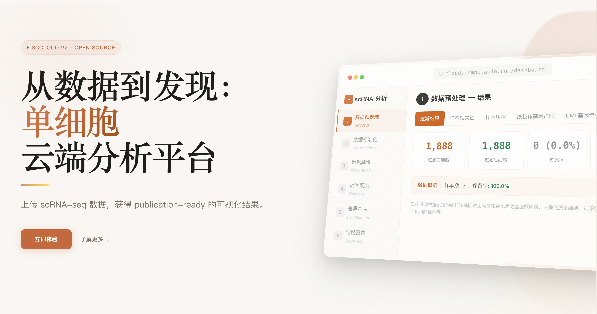
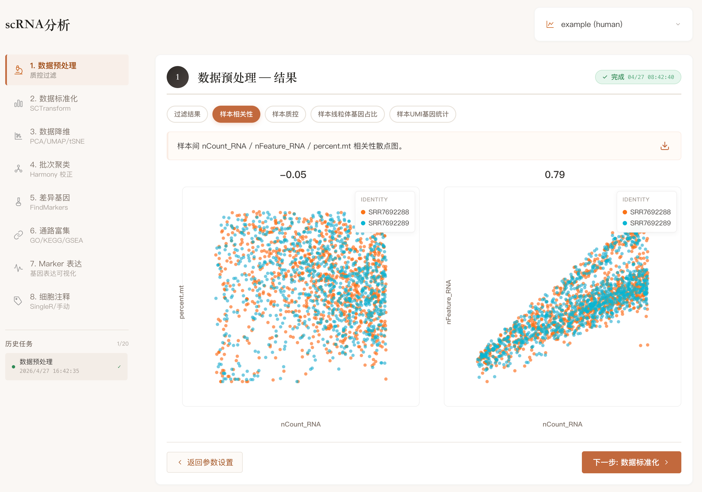
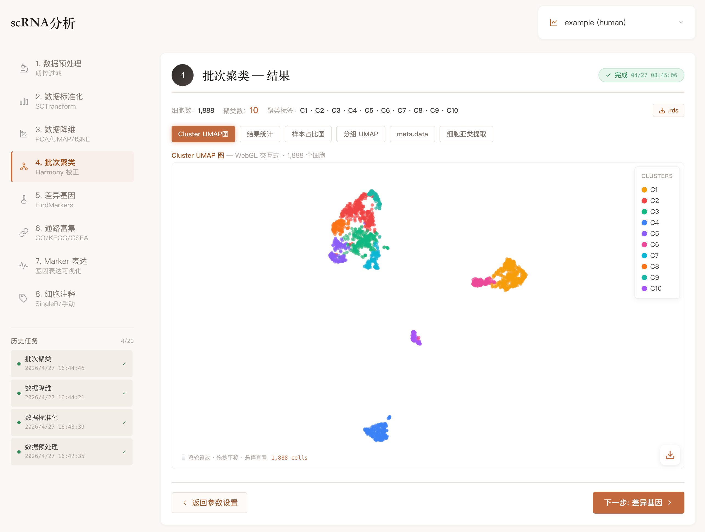
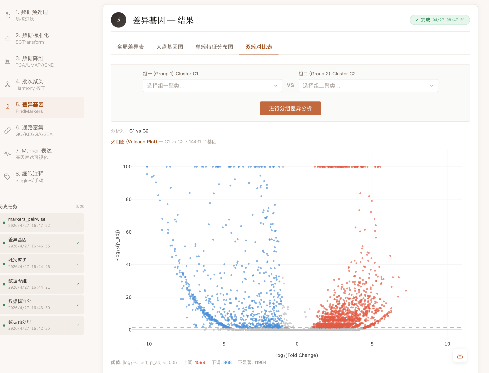

# scCloud

浏览器里做单细胞 RNA-seq 分析：上传数据 → 跑全流程 Pipeline（质控、聚类、注释，以及差异基因、富集、CellChat 等）→ 看图和下结果。

技术栈概览：Next.js 前端、FastAPI 后端、R / Seurat 5 计算、MariaDB、Redis，用 Docker 一键拉起。

<p align="left">
  
  
  
  
</p>



## 部署条件

- 一台 **Linux x86_64（amd64）** 机器（当前预构建计算镜像仅支持 amd64）
- [Docker](https://docs.docker.com/get-docker/) ≥ 24，带 **Compose v2**（`docker compose version` 有输出）
- 内存建议 ≥ 16 GB（大数据集 32 GB+）
- 磁盘预留几十 GB（镜像 + 你的项目数据）
- 能访问 GitHub 容器仓库（`ghcr.io`），用于拉取镜像

## 一键启动

```bash
git clone https://github.com/zyzhou-saffron/sccloud.git
cd sccloud
sh ./start.sh
```

脚本会：

1. 检查 Docker / Compose  
2. 首次运行生成配置和密钥（`./.env`、`./secrets/`，不会进 git）  
3. 拉取预构建镜像并启动全部服务  
4. 若默认端口被占用，自动换一个并写进配置  

完成后看终端提示的地址，一般是：

```text
http://localhost:8080
```

（若换过端口，以终端打印的 `WEB_PORT` 为准。）

健康检查：打开 `http://localhost:<端口>/healthz`，应返回正常状态。

### 首次登录

空库第一次启动会创建管理员（仅此一次）：

| | 默认 |
|---|---|
| 用户名 | `admin` |
| 密码 | `admin123`（若你改过 `./secrets/bootstrap-admin-password` 则以文件为准） |

**登录后请立刻改密码。** 若服务绑定在 `0.0.0.0` 且对公网开放，务必先改密并加反向代理 / HTTPS。

### 日常命令

```bash
sh ./scripts/sccloud-ops.sh status   # 看容器是否在跑
sh ./scripts/sccloud-ops.sh logs     # 跟日志（Ctrl+C 退出）
sh ./scripts/sccloud-ops.sh stop     # 停止
sh ./start.sh                       # 再启动 / 更新后拉镜像再起
```

可选：

```bash
sh ./start.sh --no-pull    # 不重新拉镜像，用本机已有的
sh ./start.sh --build      # 强制本地构建（一般用户不需要）
```

## 使用方式

1. 登录（或使用站点提供的游客入口，若已开启）  
2. 创建项目并上传单细胞数据（支持常见矩阵 / 10X 等，以界面为准）  
3. 在分析页配置并提交 **全流程 Pipeline**  
   - **Phase 1**：质控 → 降维聚类 → 细胞注释  
   - 确认注释后，按需跑 **Phase 2**（markers、富集、CellChat、轨迹、inferCNV 等）  
4. 在结果页查看 UMAP、表格、下载图表与文件  

<details>
<summary>界面示例</summary>

**UMAP**  


**火山图**  


**Marker**  


</details>

## 数据存储

- **账号、项目名、任务状态**：存在数据库里（Docker 卷，随 compose 项目保留）。  
- **表达矩阵、分析结果等大文件**：在统一的数据卷中，容器内路径为 `/data/projects`，按用户与项目分目录。  
- 执行 `docker compose down -v` 或删除相关 volume **会清空数据库和项目文件**，生产环境请先备份。  
- 游客账号若开放，数据保留时间较短，重要分析请注册正式用户。

## 常见问题

**端口被占用**  
`start.sh` 会在 `WEB_PORT` 起自动尝试后面几个端口。也可在 `.env` 里改 `WEB_PORT=8090` 后再 `sh ./start.sh`。

**打不开页面**  
先看 `sh ./scripts/sccloud-ops.sh status` 是否都是 healthy / running，再访问 `/healthz`。日志：`sh ./scripts/sccloud-ops.sh logs`。

**拉取镜像失败**  
检查能否访问 `ghcr.io`。公司网络需代理时，给 Docker 配好代理后重试 `sh ./start.sh`。

**分析一直失败 / 内存不足**  
大数据集需要更大内存；可在 `.env` 中调整 `R_ENGINE_MEM_LIMIT`、`R_WORKER_MEM_LIMIT`（默认约 16g / 32g）后重启。

**忘记管理员密码**  
若库是空库重来，删 volume 后会按 `./secrets/bootstrap-admin-password` 再创建（**会丢数据**）。已有数据时需在库内改用户密码或联系部署管理员，不要对生产库随意 `down -v`。

**ARM 电脑（Apple Silicon 等）**  
前端与 R 计算镜像当前按 **amd64** 交付；在 ARM 上可能无法直接跑通完整栈。请使用 amd64 服务器或云主机。

## 架构简介

```text
浏览器 → Nginx（对外 WEB_PORT）
           ├─ 前端 Next.js
           ├─ 后端 FastAPI（API / 登录 / 任务）
           └─ R 计算（分析）+ Worker（排队跑重任务）
         MariaDB（元数据）  Redis（队列与进度）
```

一键模式默认只对外暴露 **一个** Web 端口；其它服务在 Docker 网络内部通信。

## 维护者文档

发版、CI 镜像、R 引擎构建与 host 网络部署等，见 **[docs/MAINTAINERS.md](docs/MAINTAINERS.md)**。

## License

Original application code is released under the [MIT License](LICENSE). Third-party dependencies retain their respective licenses.
